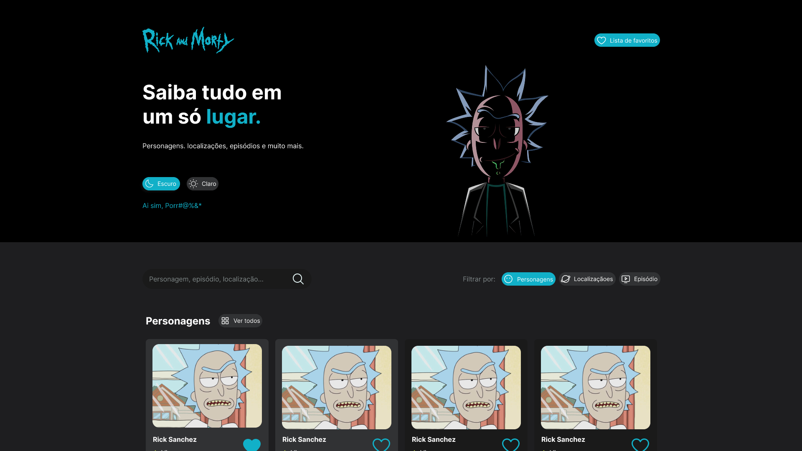
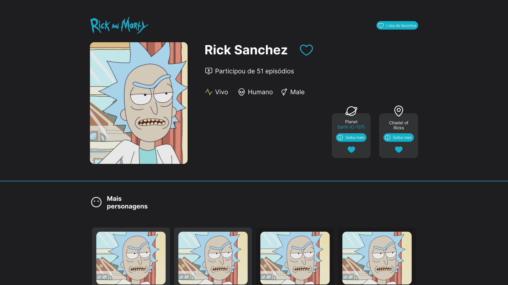

# 🌌 Rick and Morty - Wiki Interativa  


> Saiba tudo sobre o universo de Rick and Morty em um só lugar!  
> Projeto desenvolvido durante o **Curso COMPLETO e Gratuito de Nuxt.js** ([Playlist YouTube](https://www.youtube.com/playlist?list=PL_m43UlJFjF5wecIJOybo82vEUlEioP9W)).

---

## 🖼️ Prévia do Projeto  

### 🏠 Página Inicial  


### 👤 Detalhes do Personagem  


> *(As imagens acima mostram como deverá ficar o projeto final — cards de personagens, episódios e página individual de personagem.)*

---

## 🚀 Sobre o Projeto  

Este projeto foi construído utilizando **Nuxt 4** e consome dados diretamente da **API pública do Rick and Morty** ([rickandmortyapi.com](https://rickandmortyapi.com/api/)).  
A proposta é criar uma **enciclopédia interativa**, com informações sobre **personagens, episódios e localizações**, tudo organizado de forma intuitiva e visualmente agradável.

Atualmente, o projeto conta com:  
✅ Página principal com cabeçalho, listas de personagens e episódios  
✅ Cards de personagens com status e botão “Saiba mais”  
✅ Página individual para cada personagem (imagem + informações básicas)  
✅ Rodapé com créditos e link do desenvolvedor  

🧩 *Design inspirado no [Figma oficial](https://www.figma.com/design/Wb6rkMX6HWesHhie85NnEm/Rick-and-Morty--Community-?node-id=0-1&p=f&t=q8MCq0lOFJ6uOf08-0)*  

---

## 🧠 O que ainda está por vir  

O curso teve seu último vídeo publicado em **setembro**, então o projeto ainda está em desenvolvimento.  
Essas são as próximas etapas planejadas:  

- 🌍 Criar páginas detalhadas de **localizações**  
- 📺 Página completa de **episódios**  
- 💬 Traduzir automaticamente informações da API (de inglês para português)  
- 🎨 Migrar **Tailwind** para **CSS puro e Bootstrap** (facilitando manutenção)  
- 🖤 Implementar **sistema de favoritos** (com ícones dinâmicos)  
- 🌗 Adicionar **modo claro/escuro**  
- ⚙️ Melhorar responsividade e ajustar pequenos detalhes de CSS  

---

## 🛠️ Tecnologias Utilizadas  

- **Nuxt 4**  
- **Vue.js 3**  
- **Bootstrap 5** (em andamento)  
- **Rick and Morty API**  
- **Figma** (para prototipagem)  

---

## ⚙️ Instalação e Execução  

Clone o repositório e instale as dependências:

```bash
# npm
npm install

# ou pnpm / yarn / bun
pnpm install
yarn install
bun install

# npm
npm run dev
```
---

## ✨ Créditos

- 👩‍💻 Desenvolvido por [Jana-SI](https://github.com/Jana-SI)
- 🔗 API: Rick and Morty API
- 🎨 Design: Figma Rick and Morty Community