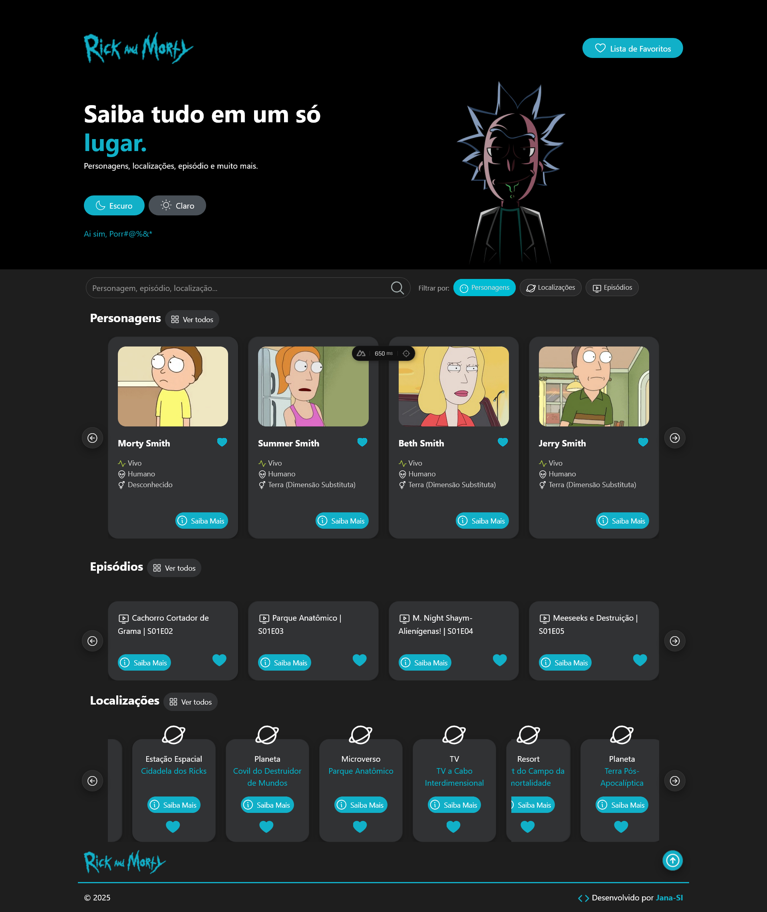
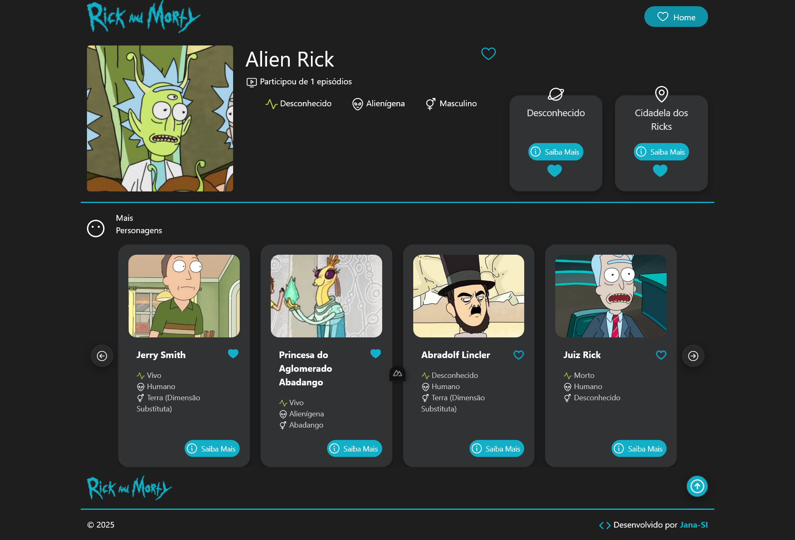

# 🌌 Rick and Morty - Wiki Interativa  


> Projeto desenvolvido durante o **Curso COMPLETO e Gratuito de Nuxt.js**  
> ([Playlist no YouTube](https://www.youtube.com/playlist?list=PL_m43UlJFjF5wecIJOybo82vEUlEioP9W)).

---

## 🖼️ Prévia do Projeto  

### Página Inicial  


### Detalhes do Personagem  


---

## 🚀 Sobre o Projeto  

Este projeto foi desenvolvido com o objetivo de **estudar e praticar Nuxt 4**, acompanhando o **Curso COMPLETO e Gratuito de Nuxt.js**  
([Playlist no YouTube](https://www.youtube.com/playlist?list=PL_m43UlJFjF5wecIJOybo82vEUlEioP9W)).

A aplicação consome dados diretamente da **API pública do Rick and Morty**  
([rickandmortyapi.com](https://rickandmortyapi.com/api/)) e simula uma **wiki interativa** do universo da série.

A **página inicial (Home)** é composta por seções reutilizáveis, incluindo **três carrosséis** com destaques de **personagens, episódios e localizações**, organizados de forma visual e intuitiva.  
Atualmente, o projeto também conta com uma **página dedicada aos personagens**, exibindo detalhes individuais e navegação entre eles.

### Funcionalidades atuais  

- ✅ Página inicial com múltiplos carrosséis (personagens, episódios e localizações)  
- ✅ Cards de personagens com status e botão **“Saiba mais”**  
- ✅ Página individual de personagem (imagem, informações básicas e carrossel de personagens)  
- ✅ Componentização reutilizável (cards, carrosséis, header e footer)  
- ✅ Rodapé com créditos e link do desenvolvedor  

🧩 *Design inspirado no [Figma oficial](https://www.figma.com/design/Wb6rkMX6HWesHhie85NnEm/Rick-and-Morty--Community-?node-id=0-1&p=f&t=q8MCq0lOFJ6uOf08-0)*  

---

## 🧠 Desafios para Evolução do Projeto  

Este repositório também pode ser utilizado como **base de estudo** para quem deseja praticar Nuxt 4.  
Algumas ideias de desafios para evoluir o projeto:

- 🔹 Criar uma **página dedicada para episódios**  
- 🔹 Criar uma **página dedicada para localizações**  
- 🔹 Implementar um sistema de **favoritos**, conforme o layout proposto no Figma  
- 🔹 Persistir favoritos utilizando **localStorage** ou **Pinia**  
- 🔹 Adicionar filtros e busca por nome/status 
-    Criar um **tema claro (Light Mode)** com alternância entre claro/escuro 
- 🔹 Melhorar acessibilidade e responsividade  

Esses desafios ajudam a aprofundar conceitos como **roteamento, estado global, composição de componentes e consumo de APIs** no Nuxt.

---

## 🛠️ Tecnologias Utilizadas  

- **Nuxt 4**  
- **Vue.js 3**  
- **Bootstrap 5**  
- **Rick and Morty API**  
- **Figma**  

---

## ⚙️ Instalação e Execução  

Clone o repositório e instale as dependências:

```bash
# npm
npm install

# ou pnpm / yarn / bun
npm install
yarn install
bun install

# executar em modo desenvolvimento
npm run dev
```
---

## ✨ Créditos

- 👩‍💻 Desenvolvido por [Jana-SI](https://github.com/Jana-SI)
- 🔗 API: Rick and Morty API
- 🎨 Design: Figma Rick and Morty Community